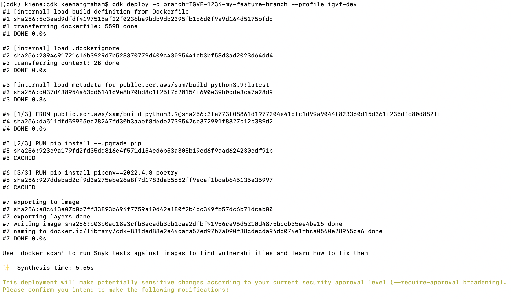
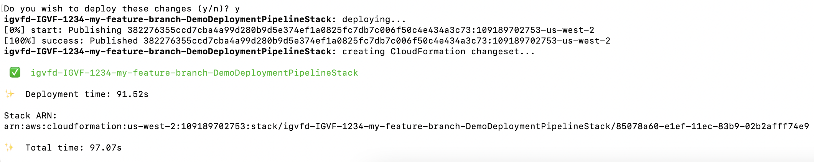
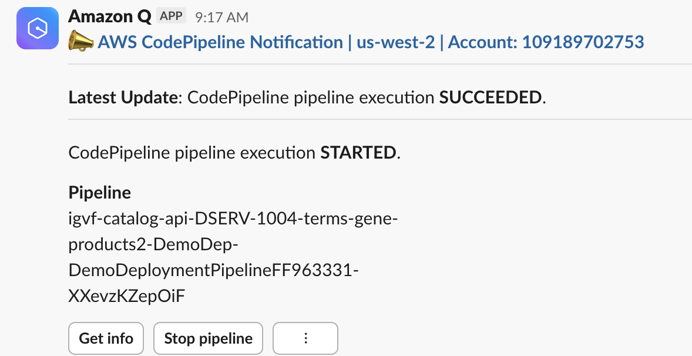
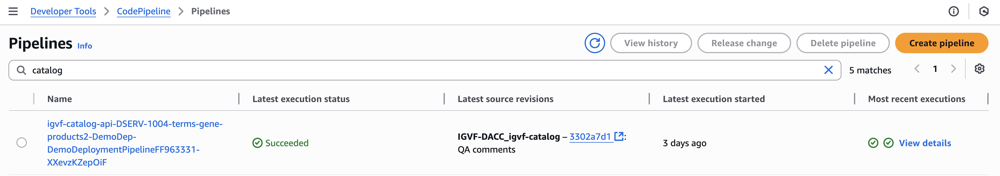
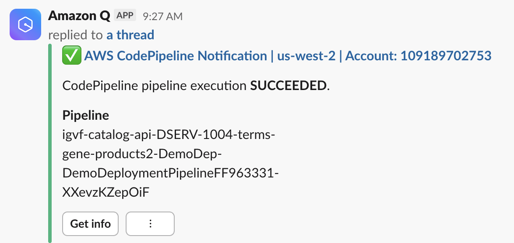
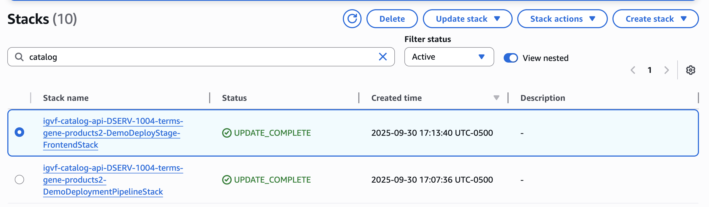
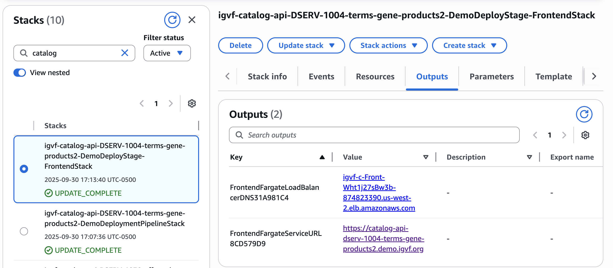
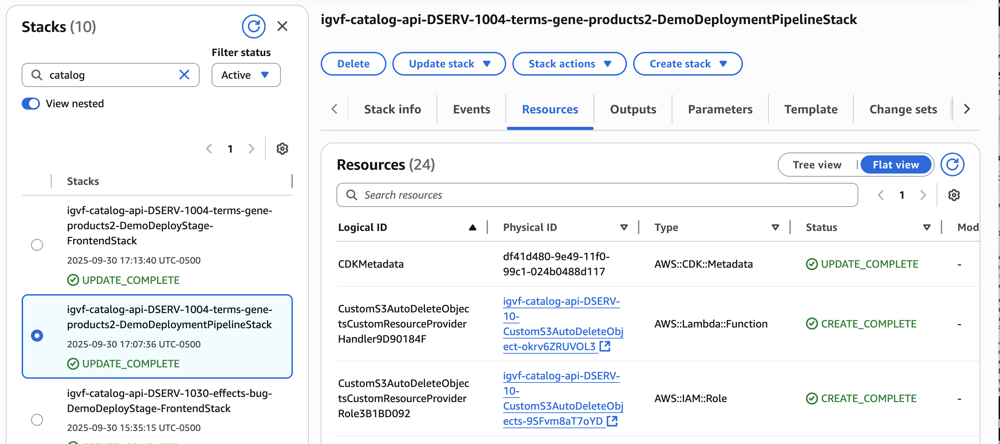
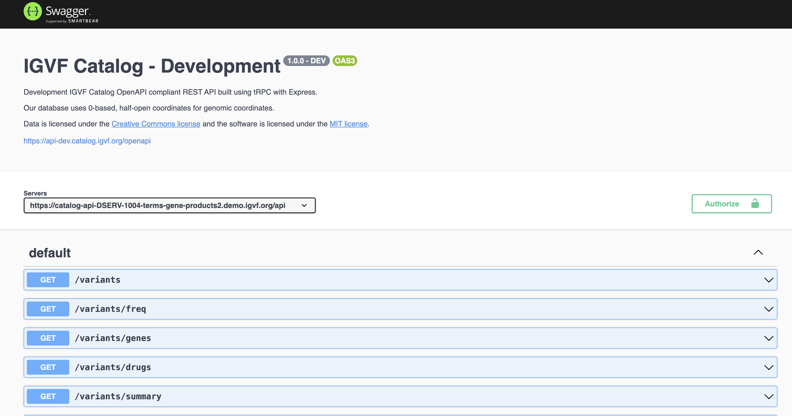

# AWS CDK Deployment

## Infrastructure

Install Node.js 20 using `nvm` (Node Version Manager):

```
# Install nvm.
$ curl -o- https://raw.githubusercontent.com/nvm-sh/nvm/v0.39.1/install.sh | bash
```

Then in new terminal:

```
# Install and use node 20.
$ nvm install 20
$ nvm use 20
# Check version.
$ node --version
```

Install CDK toolkit (requires Node.js 18.x):

```
$ npm install -g aws-cdk@2.1022.0
```

Create virtual Python 3.11 environment and install requirements:

```
$ pip install -r requirements.txt -r requirements-dev.txt
```

Make sure Docker is running.

## Deploy demo stacks

### Overview

Demo applications are not deployed directly. Instead you deploy an `AWS CodePipeline` pipeline once, tied to your Github branch, that deploys the actual application. Once the pipeline is deployed every new commit to your branch will trigger a pipeline execution that updates the application with the new commit. You can watch your pipeline in the `AWS CodePipeline` console to see the commit moving through the deployment steps.

### Configure

#### Traditional IAM user setup

Configure your AWS credentials for the `igvf-dev` account (e.g. in `igvf-dev` profile). This is the account where your demo will be deployed.

```bash
# In ~/.aws/credentials
[igvf-dev]
aws_secret_access_key = XYZ123
aws_access_key_id = ABC321
```

```bash
# In ~/.aws/config
[profile igvf-dev]
region = us-west-2
```

This sets the access key and region used when you specify `--profile igvf-dev` on the command line.

Ask to be invited to the `aws-igvf-dev` Slack channel, where you can monitor the status transitions of your deployment pipeline.

#### SSO setup

Configure your AWS credentials for the `igvf-dev` account. This is the account where your demo will be deployed.
Log in at [SSO login portal](https://igvf-dacc.awsapps.com/start/#), choose `Access Keys` under `igvf-dev` account. This will open a pop-up that shows you `SSO start URL` and `SSO Region` that you will need in the next step.
Open a terminal window and run aws sso configuration command:

```bash
aws configure sso
```

Choose `igvf-dev` account, enter the `SSO start URL` and `SSO region`, choose `PowerUserAccess` role. The `CLI Profile name` will default to `PowerUserAccess-xyz`, you might want to enter something more easy to remember, such as `igvf-dev-sso`.

This sets the access key and region used when you specify `--profile igvf-dev-sso` on the command line. This is the profile name you should use when deploying demos, or running other AWS CLI commands. The credentials you receive this way are temporary and will expire. The credentials can be renewed by repeating the above procedure.

Ask to be invited to the `aws-igvf-dev` Slack channel, where you can monitor the status transitions of your deployment pipeline.

### Command

Make sure your Python virtual environment is activated, the Node and Python requirements above are installed, and Docker is running.

Push all of your changes to your Github branch (e.g. `IGVF-1234-my-feature-branch`) before deploying. Pick a branch name that doesn't conflict with anyone else's pipeline.

```bash
git push origin IGVF-1234-my-feature-branch
```

Make sure you are in the `cdk` folder of the repo and deploy the pipeline.

```bash
cdk deploy -c branch=IGVF-1234-my-feature-branch --profile igvf-dev
```

This passes the branch name as a context variable, and tells the CDK to use your credentials for the `igvf-dev` account. It's important to match the branch name that you've pushed to Github exactly, as this is where the pipeline listens for code changes. The branch name is also used for generating a URL for the demo.

If this is the first time you've run the command the underlying Docker image used for bundling could take some time to download. You can monitor what's happening by passing the `-v` verbose flag.



Eventually you should see a list of proposed security policy changes.


Confirm that you want to make these changes.



### Monitoring deployment and resources

You should see a notification in the `aws-chatbot` Slack channel that your pipeline has `STARTED`.



You can click on that link or find your pipeline in the `AWS CodePipeline` console to watch your pipeline execute the steps to deploy the actual application.


It takes about twenty minutes for the pipeline to run tests, build Docker image assets, and spin up the infrastructure. Here you can see the first two steps in the pipeline: listening to your Github branch and synthesizing a CloudFormation template.



After the pipeline completes you should see a success notification in Slack:



And have three `AWS CloudFormation` stacks, one for the pipeline, one for Postgres, and one for the backend.



In the `AWS CloudFormation` console the URL of your demo is listed in the output tab of your backend stack.



You can see all of the actual resources (RDS instance, Fargate cluster, IAM roles, Route53 record, etc.) associated with your application in the resources tab of the stacks.



The deployed resources should have metadata tags. For example the RDS instance shows its associated branch and source snapshot.


Browse using the demo URL (e.g. `https://igvfd-igvf-1234-my-feature-branch.demo.igvf.org`):



## Clean up demo stacks

### Delete Github branch

The easiest way to clean up demo stacks is to delete the Github branch associated with them (e.g. after the branch is merged). This will automatically clean up any stacks (frontend or backend) with a matching branch name.

Note there is a lag between when a branch is deleted and when the cleaner runs and deletes demo stacks. If you try to redeploy a demo with the same branch name before the cleaner is done processing a branch, the new stacks will also get deleted.

### Manual clean up

To manually clean up demo stacks and the associated CodePipeline:

```bash
$ python commands/cdk_destroy_all_stacks.py -c branch=IGVF-1234-my-feature-branch --profile igvf-dev
# Follow (y/n) prompts...
```

Pass the `--force` flag to bypass the confirmation prompts.

### Automatic time-based clean up

By default demo stacks have a lifetime of 72 hours, after which they get destroyed. Additionally, by default the demo stacks will be deleted during the Friday night (Friday night means 0000-0659 hours on Saturday, US/Pacific timezone). This behavior is configured in `cdk/infrastructure/config.py`. Altering the default behavior can be done by editing and committing changes to values in

```bash
'tags': [
    ('time-to-live-hours', '72'),
    ('turn-off-on-friday-night', 'yes'),
],
```

In `turn-off-on-friday-night` tag, any value other than `yes` is interpreted as a negative (as well as the absence of the tag).

## Notes on demos

Avoid deploying a demo stack to our primary/shared branches (e.g. `dev` or `main`) as these already have their own pipelines associated with them. If you want to deploy your own demo that matches `dev`, for example, first checkout `dev`, pull all of the changes, and then copy them to your own branch with a special name:

```bash
git checkout dev
git pull
git checkout -b dev-keenan
```

Then use this new branch to deploy your pipeline.

## Useful commands

* `cdk ls`          list all stacks in the app
* `cdk synth`       emits the synthesized CloudFormation template
* `cdk deploy`      deploy this stack to your default AWS account/region
* `cdk diff`        compare deployed stack with current state
* `cdk docs`        open CDK documentation

## Run type checking with mypy

```bash
# In cdk folder.
$ pip install -r requirements.txt -r requirements-dev.txt
$ mypy .
```

Runs in strict mode, excluding `test` folder.
