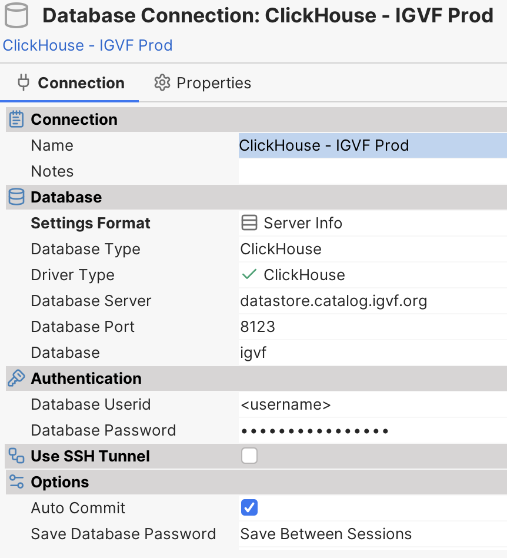

# Connecting to the IGVF Datastore (ClickhouseDB)

This guide provides instructions on how to connect to the IGVF Datastore, the columnar database ClickhouseDB.

We provide two instances of the ClickhouseDB:

* https://datastore.catalog.igvf.org - the production instance
* https://datastore-dev.catalog.igvf.org - the development instance

Both are available using the port 8123. The endpoints above are just addresses, clicking on them will not lead to any page.

The production instance has our current publicly available data. The development instance has our current work in progress and it is usually used to share ideas with other groups before the final content is officially released in production.

There are several forms to connect to a Clickhouse database.

The most basic form is by using its native client. If you have it installed, you can use the following command:

```
clickhouse-client --host=datastore.catalog.igvf.org --port=8123 --user=<username> --password=<password>
```

Please contact our group to receive a username and password.

We recommend using a database management tool to interact with our database. It is easier and doesn't require much more knowledge of Clickhouse to explore the data.

One free client that supports connection to ClickhouseDB is DBVisualizer (https://www.dbvis.com/).

To set up DBVisualizer, create a new Database Connection and select Clickhouse.

As the database server name, use: `datastore.catalog.igvf.org` or `datastore-dev.catalog.igvf.org`, for the database port use `8123`, and for the database value, use `igvf`. Next, add your credentials to Userid and Password.

Here is the configuration screenshot for DBVisualizer Free version 24.2.2:



Once the connection is established, you should be able to explore all available tables and run queries.

For more information about how you can query the data, please check the official ClickhouseDB documentation at https://clickhouse.com/docs/en/guides/writing-queries and the complete available SQL reference at https://clickhouse.com/docs/en/sql-reference/statements/select.
