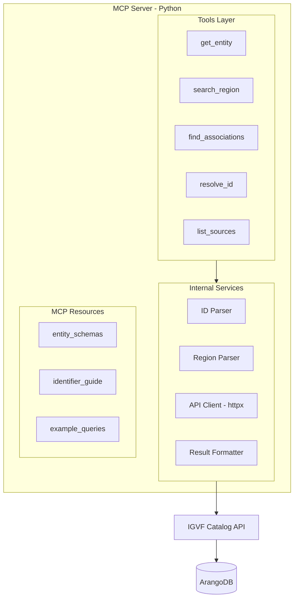

# IGVF Catalog MCP Server Design

## Architecture Overview




## Tool Specifications

### 1. `get_entity` - Universal Entity Lookup

**Purpose**: Single entry point for looking up any biological entity.**LLM-Friendly Features**:

- Auto-detects entity type from ID pattern (eliminates tool selection burden)
- Accepts multiple ID formats for same entity
- Case-insensitive gene symbols

**Parameters**:

```python
{
    "id": str,              # Required: ENSG00000141510, rs1234, BRCA1, etc.
    "hint": str | None      # Optional: "gene", "variant", "protein", "transcript", "disease", "drug"
}
```

**Auto-Detection Rules**:| Pattern | Entity Type | API Endpoint ||---------|-------------|--------------|| `ENSG*` | gene | `/genes?gene_id=` || `ENST*` | transcript | `/transcripts?transcript_id=` || `ENSP*` | protein | `/proteins?protein_id=` || `rs[0-9]+ `| variant | `/variants?rsid=` || `NC_*` | variant | `/variants?spdi=` or `?hgvs=` || `CA[0-9]+ `| variant | `/variants?ca_id=` || `HGNC:[0-9]+ `| gene | `/genes?hgnc_id=` || `Orphanet_*`, `MONDO_*`, `EFO_*` | ontology | `/ontology-terms?term_id=` || `PA[0-9]+ `| drug | `/drugs?drug_id=` || `CPX-*` | complex | `/complexes?complex_id=` || `[A-Z][A-Z0-9]+ `(2-10 chars) | gene (symbol) | `/genes?name=` |**Returns**: Normalized entity object with `_type` field added.---

### 2. `search_region` - Genomic Region Query

**Purpose**: Find all entities within a genomic region.**LLM-Friendly Features**:

- Flexible region format parsing
- Returns multiple entity types in one call
- Sensible defaults

**Parameters**:

```python
{
    "region": str,              # Required: "chr1:1000000-2000000" or "1:1M-2M"
    "include": list[str] | None,  # Optional: ["genes", "variants", "regulatory_elements"]
    "organism": str,            # Default: "human" (or "mouse")
    "limit": int                # Default: 25 per entity type
}
```

**Region Parser** normalizes:

- `chr1:1000000-2000000` ✓
- `1:1000000-2000000` → `chr1:...`
- `chr1:1,000,000-2,000,000` → remove commas
- `chrX:1M-2M` → expand M notation

**Returns**: `{ genes: [...], variants: [...], regulatory_elements: [...] }`---

### 3. `find_associations` - Relationship Query

**Purpose**: Find connections between entities in the knowledge graph.**LLM-Friendly Features**:

- Semantic relationship types (not API endpoint names)
- Works from either direction
- Includes context (p-values, tissues, sources)

**Parameters**:

```python
{
    "entity_id": str,       # Required: starting entity
    "relationship": str,    # "regulatory", "genetic", "physical", "functional", "pharmacological", or "all"
    "filters": {            # Optional filters
        "p_value": float,   # e.g., 0.05
        "source": str,      # e.g., "GTEx", "GWAS Catalog"
        "tissue": str       # e.g., "liver", "brain"
    } | None,
    "limit": int            # Default: 25
}
```

**Relationship Mapping**:| Semantic Type | API Endpoints ||---------------|---------------|| `regulatory` | `/genes/variants`, `/variants/genes`, `/genomic-elements/genes` || `genetic` | `/variants/phenotypes`, `/variants/diseases`, `/genes/diseases` || `physical` | `/proteins/proteins`, `/complexes/proteins` || `functional` | `/genes/pathways`, `/go/annotations` || `pharmacological` | `/variants/drugs`, `/drugs/variants` |**Returns**: Array of associations with source entity, target entity, relationship metadata.---

### 4. `resolve_id` - Identifier Translation

**Purpose**: Convert between identifier formats and find all known aliases.**LLM-Friendly Features**:

- Handles the "I have rsID, need SPDI" problem
- Returns all known aliases at once

**Parameters**:

```python
{
    "id": str,              # Required: any identifier
    "target_type": str | None  # Optional: preferred output format
}
```

**Returns**:

```json
{
  "input": "rs1234",
  "entity_type": "variant",
  "identifiers": {
    "rsid": "rs1234",
    "spdi": "NC_000001.11:12345:A:G",
    "hgvs": "NC_000001.11:g.12346A>G",
    "ca_id": "CA12345"
  }
}
```

---

### 5. `list_sources` - Data Source Discovery

**Purpose**: Discover available data sources, methods, and filter options.**LLM-Friendly Features**:

- Solves the "what are valid enum values" problem
- Dynamic discovery instead of memorization

**Parameters**:

```python
{
    "category": str | None  # Optional: "variant_annotations", "gene_expression",
                            # "regulatory", "disease", "drugs", "interactions", "studies"
}
```

**Returns**: Available sources with descriptions.---

## MCP Resources (Read-Only Data)

| Resource URI | Content ||--------------|---------|| `igvf://schemas/gene` | Gene entity schema with field descriptions || `igvf://schemas/variant` | Variant entity schema || `igvf://guide/identifiers` | How to recognize and format different ID types || `igvf://examples/queries` | Common query patterns with expected results |---

## Implementation Structure

All MCP server code lives in `igvf-catalog-mcp/` at the repo root, separate from the main TypeScript API:

```javascript
igvf-catalog/                 # Existing repo root
├── src/                      # Existing TypeScript API
├── data/                     # Existing data adapters
└── igvf-catalog-mcp/         # NEW: MCP server (Python)
    ├── pyproject.toml        # Project config, dependencies
    ├── README.md
├── src/
│   └── igvf_catalog_mcp/
│       ├── __init__.py
│       ├── server.py         # MCP server entry point
│       ├── tools/
│       │   ├── __init__.py
│       │   ├── get_entity.py
│       │   ├── search_region.py
│       │   ├── find_associations.py
│       │   ├── resolve_id.py
│       │   └── list_sources.py
│       ├── services/
│       │   ├── __init__.py
│       │   ├── api_client.py     # Async IGVF API client (httpx)
│       │   ├── id_parser.py      # Entity type detection
│       │   ├── region_parser.py  # Region format normalization
│       │   └── formatter.py      # Response formatting
│       └── resources/
│           ├── __init__.py
│           ├── schemas.py
│           └── examples.py
└── tests/
    ├── test_id_parser.py
    ├── test_region_parser.py
    └── test_tools/
```

---

## Python Dependencies

```toml
[project]
name = "igvf-catalog-mcp"
version = "0.1.0"
requires-python = ">=3.10"
dependencies = [
    "mcp>=1.0.0",           # MCP Python SDK
    "httpx>=0.27.0",        # Async HTTP client
    "pydantic>=2.0.0",      # Data validation
]

[project.optional-dependencies]
dev = [
    "pytest>=8.0.0",
    "pytest-asyncio>=0.23.0",
    "ruff>=0.4.0",
]
```

---

## Key Design Decisions

### 1. Python Implementation

Use Python with the official `mcp` SDK. Benefits:

- Team has strong Python expertise
- Excellent fit for bioinformatics domain
- Async support via `httpx` for concurrent API calls
- Type hints with Pydantic for validation

### 2. External API Client (Not Direct DB)

Query via the REST API rather than direct ArangoDB access. This:

- Respects existing API contracts and validation
- Works with the production API at `api.catalog.igvf.org`
- Avoids duplicating business logic

### 3. Configurable Base URL

Allow pointing to dev (`api-dev.catalog.igvf.org`) or local (`localhost:2023`) instances via environment variable:

```bash
IGVF_CATALOG_API_URL=https://api.catalog.igvf.org  # default
```


### 4. Error Messages as Guidance

When validation fails, return helpful messages:

```python
"Invalid region format 'chr1-1000-2000'. Expected format: 'chr1:1000-2000'. "
"The colon separates chromosome from position range."
```


### 5. Pagination Abstraction

Tools handle pagination internally where sensible, with a `limit` parameter for user control.

### 6. Async by Default

Use `httpx.AsyncClient` for API calls to enable concurrent requests (e.g., `search_region` querying multiple endpoints in parallel).---

## Example Usage Scenarios

**Scenario 1: "Tell me about BRCA1"**

```javascript
Tool: get_entity
Input: {"id": "BRCA1"}
→ Auto-detects gene symbol, calls /genes?name=BRCA1
→ Returns gene info with coordinates, type, HGNC ID
```

**Scenario 2: "What variants affect TP53 expression?"**

```javascript
Tool: find_associations
Input: {"entity_id": "TP53", "relationship": "regulatory"}
→ Resolves TP53 to ENSG00000141510
→ Calls /genes/variants?gene_name=TP53
→ Returns eQTLs with p-values, tissues, effect sizes
```

**Scenario 3: "What's in chr17:41M-42M?"**

```javascript
Tool: search_region
Input: {"region": "chr17:41000000-42000000"}
→ Parallel calls to /genes, /variants, /genomic-elements with region filter
→ Returns genes (including BRCA1), variants, regulatory elements
```

**Scenario 4: "Convert rs80357906 to SPDI format"**

```javascript
Tool: resolve_id
Input: {"id": "rs80357906"}
→ Calls /variants?rsid=rs80357906
→ Returns all known identifiers including SPDI, HGVS, CA ID
```

---

## Phase 1 Deliverables

1. **MCP server scaffolding** with tool registration
2. **ID parser** with comprehensive pattern matching
3. **Region parser** with flexible format support
4. **API client** with typed responses
5. **`get_entity` tool** - the most frequently used tool
6. **`search_region` tool** - core genomics use case
7. **Basic tests** for parsers and core tools

## Phase 2 Deliverables

8. **`find_associations` tool** - relationship queries
9. **`resolve_id` tool** - identifier translation
10. **`list_sources` tool** - dynamic discovery
11. **MCP resources** for schemas and examples

## Phase 3 Deliverables
