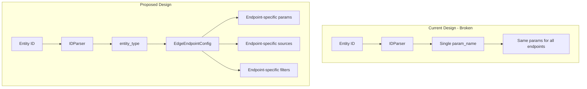

# Improve MCP Server Edge-Related Tools

## Problem Statement

The current `find_associations` tool uses a simplified parameter mapping that doesn't account for:

- Different edge endpoints expecting different parameter names
- Endpoint-specific source enum values
- Endpoint-specific filter parameters
- Missing relationship types (LD, coexpression, coding variants)

## Architecture Overview




## Solution: Create Edge Endpoint Configuration System

### 1. Create [`igvf-catalog-mcp/src/igvf_catalog_mcp/services/edge_config.py`](igvf-catalog-mcp/src/igvf_catalog_mcp/services/edge_config.py)

Define a configuration registry for each edge endpoint:

```python
EDGE_ENDPOINTS = {
    "variants_genes": {
        "path": "/api/variants/genes",
        "from_type": "variant",
        "to_type": "gene",
        "from_params": ["variant_id", "spdi", "hgvs", "rsid", "ca_id"],
        "to_params": ["gene_id", "gene_name"],
        "sources": ["AFGR", "EBI eQTL Catalogue", "IGVF"],
        "labels": ["eQTL", "splice_QTL", "variant effect on gene expression"],
        "filters": {
            "log10pvalue": "range",  # supports gt:, gte:, lt:, lte:
            "effect_size": "range",
            "biological_context": "string",
        }
    },
    "variants_proteins": {
        "path": "/api/variants/proteins",
        "from_type": "variant",
        "to_type": "protein",
        "from_params": ["variant_id", "spdi", "hgvs", "rsid", "ca_id"],
        "sources": ["ADASTRA", "GVATdb", "UKB", "SEMVAR"],
        "labels": ["pQTL", "allele-specific binding"],
        ...
    },
    # ... more endpoints
}
```


### 2. Update [`igvf-catalog-mcp/src/igvf_catalog_mcp/tools/find_associations.py`](igvf-catalog-mcp/src/igvf_catalog_mcp/tools/find_associations.py)

- Use the edge config to build correct parameters per endpoint
- Map filters to endpoint-specific parameter names
- Validate source values against allowed enums
- Add `verbose` parameter support

### 3. Update [`igvf-catalog-mcp/src/igvf_catalog_mcp/tools/list_sources.py`](igvf-catalog-mcp/src/igvf_catalog_mcp/tools/list_sources.py)

- Replace hardcoded source lists with values derived from edge config
- Add endpoint-specific filtering to show valid sources for each relationship type

### 4. Add New Tool: `find_ld` for Linkage Disequilibrium

The `/variants/variants` endpoint is important and has unique parameters (`r2`, `d_prime`, `ancestry`). A dedicated tool would be clearer:

```python
FIND_LD_TOOL = Tool(
    name="find_ld",
    description="Find variants in linkage disequilibrium with a query variant",
    inputSchema={
        "properties": {
            "variant_id": {"type": "string"},
            "r2_threshold": {"type": "number", "minimum": 0, "maximum": 1},
            "ancestry": {"enum": ["EUR", "AFR", "EAS", "SAS", "AMR"]},
        }
    }
)
```


### 5. Expand Relationship Type Mapping

Add missing relationship types to `RELATIONSHIP_ENDPOINTS`:| Relationship | Entity Types | Endpoints |

|--------------|--------------|-----------|

| `regulatory` | gene, variant | `/genes/variants`, `/variants/genes`, `/genomic-elements/genes` |

| `genetic` | gene, variant | `/genes/diseases`, `/variants/phenotypes`, `/variants/diseases` |

| `physical` | protein, gene, complex | `/proteins/proteins`, `/complexes/proteins`, `/genes/genes` |

| `functional` | gene, protein | `/genes/pathways`, `/annotations/go-terms` |

| `pharmacological` | variant, drug | `/variants/drugs`, `/drugs/variants` |

| `ld` (new) | variant | `/variants/variants` |

| `coding` (new) | variant | `/variants/coding-variants`, `/coding-variants/phenotypes` |

## Implementation Order

1. Create edge configuration system (core infrastructure)
2. Update `find_associations` to use new config
3. Fix `list_sources` with accurate source values
4. Add `find_ld` tool for LD queries
5. Add tests for edge parameter mapping
6. Update `IMPLEMENTATION_GUIDE.md`

## Key Files to Modify

- Create: [`igvf-catalog-mcp/src/igvf_catalog_mcp/services/edge_config.py`](igvf-catalog-mcp/src/igvf_catalog_mcp/services/edge_config.py)
- Modify: [`igvf-catalog-mcp/src/igvf_catalog_mcp/tools/find_associations.py`](igvf-catalog-mcp/src/igvf_catalog_mcp/tools/find_associations.py)
- Modify: [`igvf-catalog-mcp/src/igvf_catalog_mcp/tools/list_sources.py`](igvf-catalog-mcp/src/igvf_catalog_mcp/tools/list_sources.py)
- Create: [`igvf-catalog-mcp/src/igvf_catalog_mcp/tools/find_ld.py`](igvf-catalog-mcp/src/igvf_catalog_mcp/tools/find_ld.py)
- Modify: [`igvf-catalog-mcp/src/igvf_catalog_mcp/server.py`](igvf-catalog-mcp/src/igvf_catalog_mcp/server.py) (register new tool)
